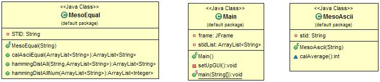

# Project5

## Problem Solving Approach:
1. After looking at the demo, I determined what
would need to be done for GUI, what calculations would need to be made, and how to set it all up
    - Main method would only construct the frame
    - Constructor would make the GUI and implement action listeners
    - Calculations occur in separate classes
    - AsciiAverage calculation has its own class
    - finding hamming distances and stations with the same average has its own class

### Analysis of Implemented Code:
1. Main Class:
    - Created a private string variable that would hold the String
        STIDlist
    - Constructor constructs the GUI frame
    - setUpGui creates all the components of the GUI
      - uses gridBagLayout for components
      - jlabel set up for "enter hamming distance"
      - jTextField set up for the box that shows the distance
      - jSlider set up with 4 ticks, that only allow whole #'s 1-4
          - slider value is reflected in jtextfield
          - actionListener set up with slider linked to text field
      - jButton set up "show station"
          - actionlistener set up so that if pressed, it shows all stations within the hammingDistance
            selected by the slider in the text area
      - jTextArea created that shows all strings that are within the specified hamming distance
      - jLabel created that says "compare with:"
      - jComboBox created that shows all the STID values
      - Jbutton created that calculates the hamming distance between the selected STID in the combobox and the Mesonet.txt
          - actionListener added to change later text fields
      - 5 jLabel's created that say "Distance 0-5"
      - 5 jTextFields created that are uneditable
          - jbutton with actionlistener changes text fields based on the distances
      - jButton "add station" created
          - actionlistener added that adds the typed string into the combobox
      - jTextfield created that allows you to type a string thats added to the combobox
      - jButton created that is "calculate asciiAverage"
          - actionlistener added that calculates the average and displays it in a textfield and stations
              with matching asciiAverage in the textArea
      - jTextField created that shows the ascii average
      - jTextArea created that shows all stations with the same asciiAverage
      
2. MesoAscii Class:
    - calculates the asciiAverage between two strings
3. MesoEqual Class:
    - calAsciiEqual method returns an arraylist of strings that have the same asciiAverage as a given string
    - hammingDistAll method returns an arraylist of strings that depends on the hamming distance selected
    - hammingDistAllNum method returns an arraylist of integers that hold the number of stations with a hamming distance of
        0, 1, 2, 3, and 4
  

